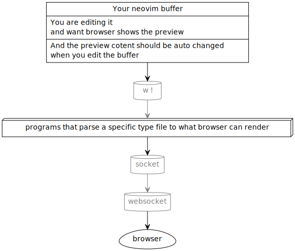

# preview.nvim[<sub><i>github</i></sub>]()  

Preview anything in neovim<sub><i>or vim</i></sub>.

## How to use it

### Requirement

- Platform
	- Linux
- Editor
	- neovim<sub><i>or vim</i></sub>
		- vim 8 or later
		- neovim is preferred
		- Ensure editor can detech filetype, and set <code>&ft</code>.
			try Running <code>:set ft</code> in a specific filetype file.
- Browser
	- Ensure the browser support websocket
	- Ensure the browser can open a html as an argument in command line
	- You can set it by set <code>g:preview_browser</code>
- [golang](https://go.dev/)
	- Program is written by go language, so
		ensure go programs can works

### Quick start

```
make -B -f makefile.default
```

And then edit a file in [<code>test/</code>](test/) by neovim, like

```
nvim test/preview.c
```

> [<code>ft/c/preiview.vim</code>](ft/c/preiview.vim) use <code>clang</code> as compiler,
> ensure <code>clang</code> is valid.

And run <code>:so ~/.vim/preview/preview.vim</code> in neovim.
A browser will be opened and shows the resoult if code in <code>preview.c</code> is executed.

Try editing and see changes in web page.


If <code>dot</code> is valid,
try [<code>test/lwip_dhcp_renew_calltree.dot</code>](test/lwip_dhcp_renew_calltree.dot).
<code>source ~/.vim/preview/preview.vim</code> too.

And [<code>preview.r</code>](preview.r), [<code>ft/r/preview.vim</code>](ft/r/preview.vim) is for R language.

## What <code>makefile.default</code> will do


And relative files will be:


| Description | path | Vim-variable |
| - | - | - |
| <code>preview.vim</code> | <code>~/.vim/preview/preview.vim</code> | Not in a vim variabl, You shold source it directly |
| Compiled <code>websocket.go</code> | <code>~/.vim/preview/websocket</code> | <code>g:preview_websocket_program</code> |
| Some example of specific filetypes | <code>~/.vim/preview/ft/*.vim</code> | <code>'g:preview_'.&ft.'_vimrc'</code> |

## How does it work

After <code>make -f makefile.default</code>,
assuming you are editing a
[dot](https://graphviz.org/doc/info/lang.html)
file,
and <code>:source ~/.vim/preview/preview.vim</code> in neovim,
it will works as below:


The  browser will update preview when neovim buffer change.

##  More details

> Enter subdirectories to learn about specific components.


# For developers

Content below explain
**How I design preview.nvim[<sub><i>github</i></sub>]()  itself**
 and **What I actually do**.

## What we need to do

### For sending data from neovim<sub><i>or vim</i></sub> edit buffer to browser



**GRAPH** above shows how I send data from a
*unsaved but changed* edit buffer to browser.

#### From neovim<sub><i>or vim</i></sub> edit buffer to other programs

This can be simply done by <code>:w !</code>. Just <code>:help w_c</code>.

The truly troublesome process is
convert various file types to
what browser can render(generally html).
See [<code>ft/</code>](ft/) for more details.

### For auto refresh page content when edit buffer changed

Up to now,
maybe websocket is the only choise.

More specifically,
every time the edit bufffer changed was deteted by

```
autocmd InsertLeave,TextChanged,TextChangedI <buffer>
```

<code>w !</code> will send the whole
buffer content to some programs
that convert it to renderable format,
and the converted data will be sent to
a socket.
And then websocket get it from socket,
and replace the web page content to it
by change <code>\<body/\></code>'s <code>innerHTML</code>.

These are implememted in [<code>websocket.go</code>](websocket.go)

## Combine steps above

In [<code>preview.vim</code>](preview.vim).

Besides, [<code>preview.vim</code>](preview.vim)
also startup a browser,
write socket number, websocket number to files,
and manage them by neovim<sub><i>or vim</i></sub> rpc.

> Note that preview.nvim[<sub><i>github</i></sub>]()  is mainly for neovim.
> So maybe vim would not work,
> especially about rpc.
