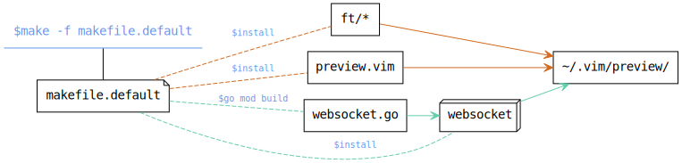
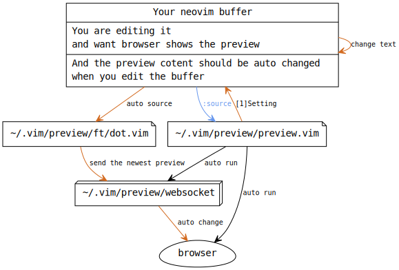

# preview.nvim

Preview anything in neovim.

## How to use it

### Requirement

- Platform
	- Linux
- Editor
	- vim or neovim
		- vim 8 or later
		- neovim is preferred
		- Ensure editor can detech filetype, and set ```&ft```.
			try Running ```:set ft``` in a specific filetype file.
- Browser
	- Ensure the browser support websocket
	- Ensure the browser can open a html as an argument in command line
	- You can set it by set ```g:preview_browser```
- [golang](https://go.dev/) 
	- Program is written by go language, so
		ensure go programs can works

### Step

1. Find out a way to send data to a TCP porrt, from ```stdin```
	- There are some examples in [```ft```](ft) directory,
		entern [ft](ft) to learn more
1. Compile ```websocket.go```
1. Keep path of those file :
	- Executable file compiled from ```websocket.go```
		- You can set its name by set ```g:preview_websocket_program```
	- ```preview.vim``` in this project. You may move it to other path
	- A ```.vim``` file of the filetype you want to preview.
		- There are some example in [```ft```](ft) directory,
			entern [ft](ft) to learn more
1. In the newovim buffer of file to preview, source ```preview.vim```
	- ```preview.vim``` will call executable file compiled from ```websocket.go```
	- ```preview.vim``` will source the ```.vim``` file of the filetype.  
	So organize them well, refer to last step.

#### You can use the default make process to do steps above

```
make -B -f makefile.default
```

##### What ```makefile.default``` will do



And relative files will be:

| Description | path | Vim-variable |
| - | - | - |
| ```preview.vim``` | ```~/.vim/preview/preview.vim``` | Not in a vim variabl, You shold source it directly |
| Compiled```websocket.go``` | ```~/.vim/preview/websocket``` | ```g:preview_websocket_program``` |
| Some example of specific filetypes | ```~/.vim/preview/ft/*.vim``` | ```'g:preview_'.&ft.'_vimrc'``` |

After ```make -f makefile.default```,
assuming you are editing a
[dot](https://graphviz.org/doc/info/lang.html)
file,
and ```:source ~/.vim/preview/preview.vim``` in neovim,
it will works as below:



The  browser will update preview when neovim buffer change.

## Quick start

```
make -B -f makefile.default
```

And then edit a file in [```test/```](test/) by neovim, like

```
nvim test/preview.c
```

> [```ft/c.vim```](ft/c.vim) use ```clang``` as compiler, ensure ```clang``` is valid.

And run ```:so ~/.vim/preview/preview.vim``` in neovim.
A browser will be opened and shows the resoult if code in ```preview.c``` is executed.

Try editing and see changes in web paeg.


If ```dot``` is valid,
try [```test/lwip_dhcp_renew_calltree.dot```](test/lwip_dhcp_renew_calltree.dot).
```source ~/.vim/preview/preview.vim``` too.

And [```preview.r```](preview.r), [```ft/r.vim```](ft/r.vim) is for R language.

## For development

See [```dAd```](dAd)
